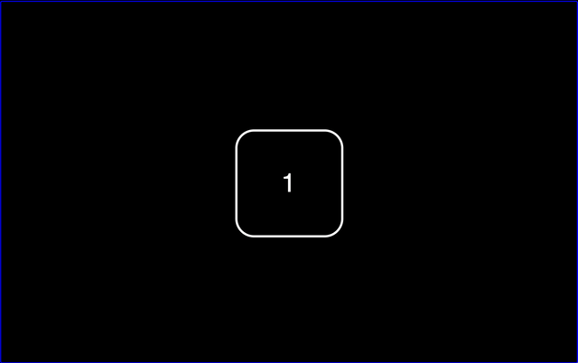
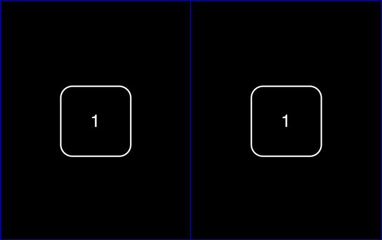

# pathless

Zero-dependency viewport allocator served within a pathless domain. 

## Overview

Within **pathless**, the viewport is a closed system with limits defined by a perimeter border. **pathless** establishes an unobstructed interface with two universal components:

 - `panel`: space in the system
 - `frame`: object in space 
 - `state`: position of an object in space

## Getting Started

| Key   | Action         | Toggle                                     |
| ----- | -------------- | ------------------------------------------ |
| `1`   | One panel      | fullscreen <-> previous layout             |
| `2`   | Two panel      | horizontal <-> vertical                    |
| `3`   | Three panel    | large panel left -> top -> right -> bottom |
| `Tab` | Cycle focus    | panel zero -> one -> two                   |
| `q`   | previous frame |                                            |
| `e`   | next frame     |                                            |

## Installation

## Documentation

`panel`'s

`frame`'s are a finite pool of simulataneously observable content, cached after first fetch. state is managed panel -> frame -> state. 

`state`

When in a multipanel layout, press `1` to make the focused panel fullscreen, press `1` again to return to the previous layout. Press `2` to toggle between side-by-side (vertical split) and stacked (horizontal split). Press `3` to cycle through 50/25/25 layouts.

The `window.pathless` object provides the API coordinating between `panels`, `frames`, and `state`.    

#### `pathless.context()`
Returns the DOM element of the focused panel, DOM element of the current frame, and panel specific frame state.

#### `pathless.fetch(url, opts)`  
Returns the parsed response `{ data, headers }`. Caching and request deduplication available using `opts.key` where a single successful round-trip makes a `value` available to all panels.

#### `pathless.onKey(handler)`
Event handler used to register `frame` keybinds, automatically scoped to the focused panel.

#### `pathless.update(key, value)`
Key-value pair's used to persist state through layout changes and navigation, automatically scoped to the `frame` of the focused `panel`.
